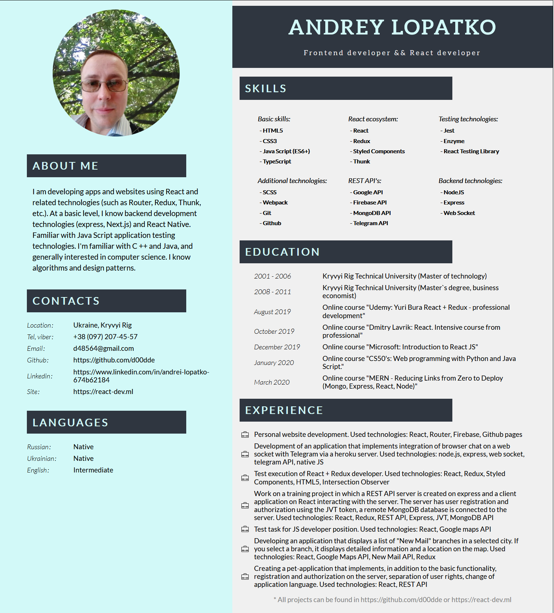

# Резюме frontend-разработчика.

:clipboard: **Задача:** Сверстать резюме, которое динамически будет получать данные из JS-файла, и, в зависимости от них, отображать резюме на русском и английском языках.

---

:arrow_right: **Реализация:** выполнено на чистом JS.

---

:white_check_mark: **Результат:** можно увидеть [здесь](https://d00dde.github.io/summary/)

---

:wrench: **Дополнительные Инструменты:**

- Webpack;
- Babel;
- SCSS;
- gh-pages.

---

[Шаблоны лендингов](https://onepagelove.com/templates/free-templates)

---

## ESP32 CAM

[Подключение через ngrok](https://github.com/techiesms/esp32-cam-mjpeg)[видео](https://www.youtube.com/watch?v=ukWvHX-JTgI)
[Конвертация в rtsp](http://psenyukov.ru/%d1%83%d1%87%d0%b8%d0%bc-esp32-cam-%d0%b2%d0%b5%d1%89%d0%b0%d1%82%d1%8c-%d0%bf%d0%be%d1%82%d0%be%d0%ba%d0%be%d0%b2%d0%be%d0%b5-%d0%b2%d0%b8%d0%b4%d0%b5%d0%be-%d0%bf%d0%be-rtsp-%d0%bf%d1%80%d0%be%d1%82/)[видео](https://www.youtube.com/watch?v=yuOPSRyBY0Y)
[Blynk Live Video Streaming Local](https://github.com/techiesms/esp32-cam-mjpeg)[видео](https://www.youtube.com/watch?v=XRcTUiXUxEM)
